# KEPL 프로젝트 보고서

*Java, Spring 활용하여 김수빈, 김유빈, 이준석, 정길웅, 황인각 5명이서 프로젝트를 구상부터 구현을 했다.*

## 프로젝트 배경

### 1. 호기심

네이버 실시간 검색어가 있던 시절에 드라마, 영화, K-Pop 에 노출 되는 장소나 물건들은 항상 실시간 검색어 상위권에 순위를 기록을 함으로 사람들의 호기심을 자극한다.

"나혼자산다 성훈이 먹었던 저 음식은 무엇일까?"

"범죄도시 장첸이 먹는 저 빨간 새우요리는 무엇일까?"

"아이유가 입은 옷 이쁘던데 무엇일까?" 

이러한 호기심에서 부터 프로젝트는 출발한다.

### 2. 코로나로 관광수요 변화

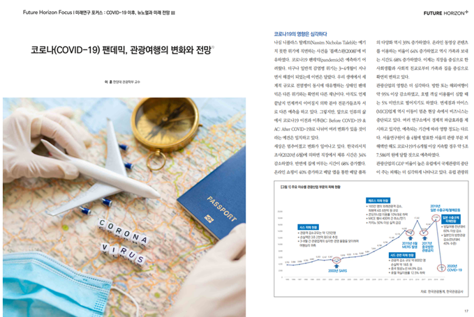

*(출처 : 미래연구 포커스 : COVID-19 이후, 뉴노멀과 미래 전망 Ⅲ - 한양대 관광학부 이훈 교수)*

코로나로 인하여 관광산업의 영향이 심각해졌다. 방한, 해외여행이 약 95 이상 감소했고, 호텔 객실 이용률이 심각할 때에는 5% 미만으로 감소했기 때문이다.

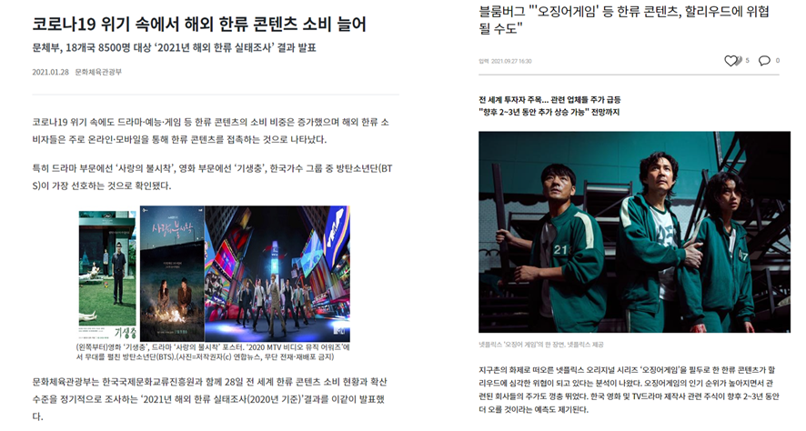

*[기사1 : 코로나19 위기](https://www.korea.kr/news/policyNewsView.do?newsId=148883262)*  

*[기사2 : 블룸버그](https://www.hankookilbo.com/News/Read/A2021092714450003822)*

올해 초 영화 기생충을 시작으로 BTS, 블랙핑크, 넷플릭스의 오징어게임, 지옥까지 다양한 한류 콘텐츠의 급부상이 되었고 

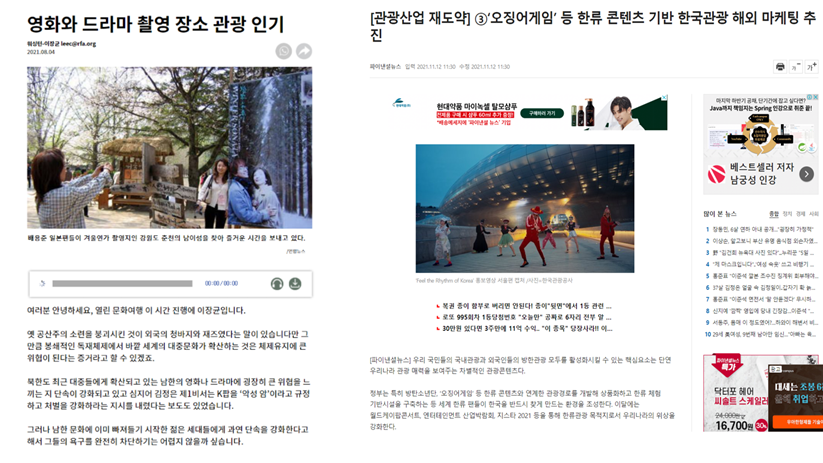

*[기사3 : 영화와 드라마 촬영장소](https://www.rfa.org/korean/weekly_program/culture_talk/openculture-08032021171221.html)*

*[기사4: 한류 콘텐츠 기반 한국관광](https://www.fnnews.com/news/202111101549592980)*

그 여파로 인하여 국내 영화와 드라마 촬영장소에 관광수요가 증가하였고, 한류 콘텐츠 기반으로 한국관광에 대한 마케팅이 추진되는 추세에 **한국콘텐츠에 등장한 장소와 정보를 공유할 수 있는 플랫폼**의 필요성 인지 하여 이 프로젝트를 구상하고 시작하였다.

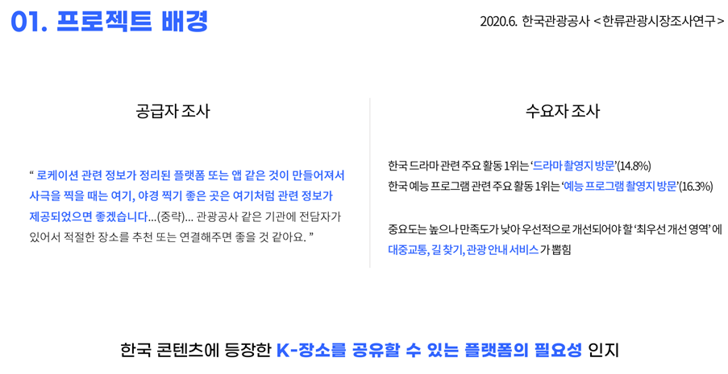

## 프로젝트 팀 구성 및 역할

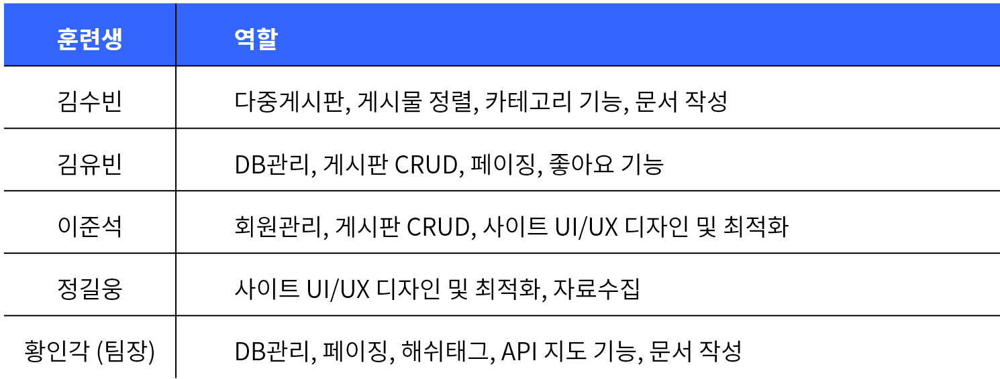

## 프로젝트 수행 절차 및 방법

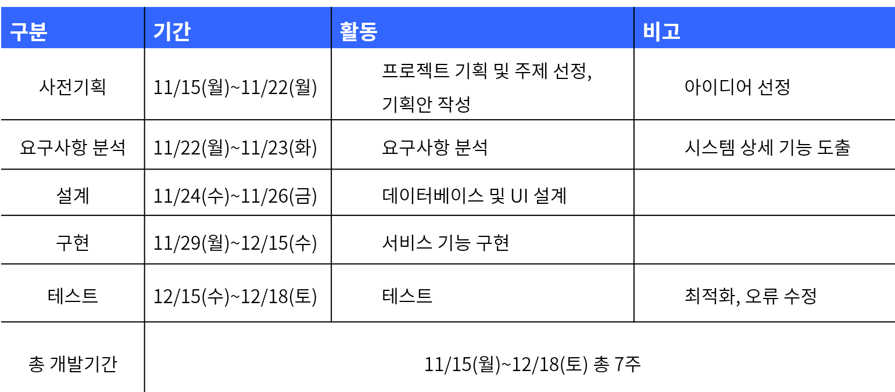

## 프로젝트 수행 결과

### 기능 Summary

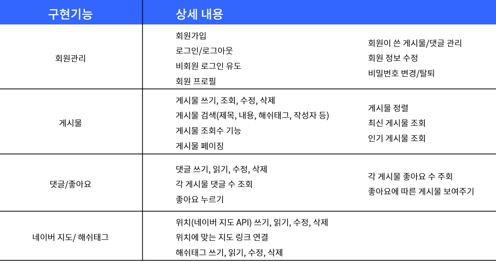

### 데이터베이스 설계

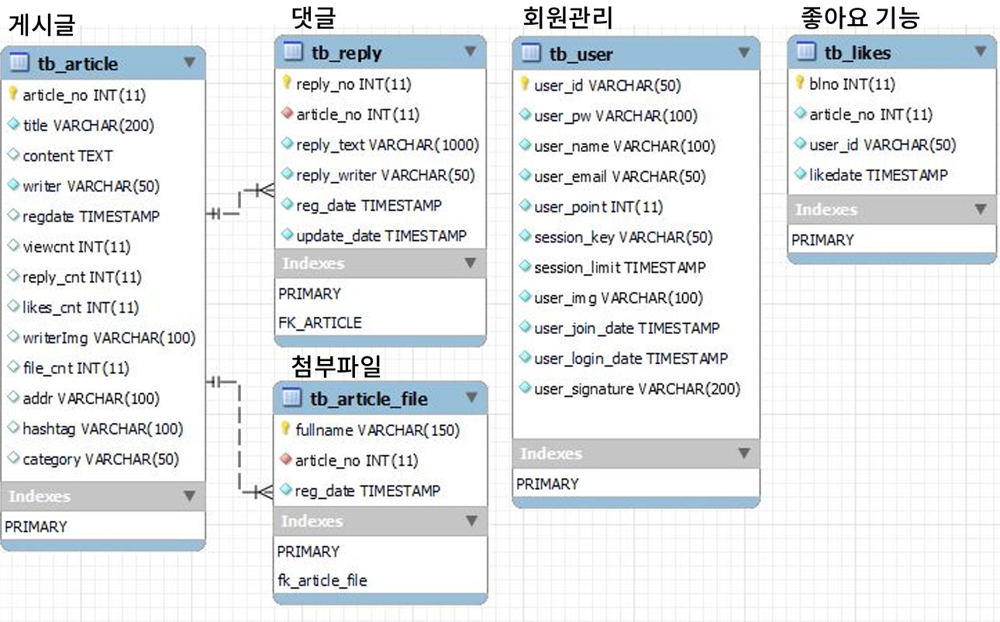

### 웹 페이지 계층 구조

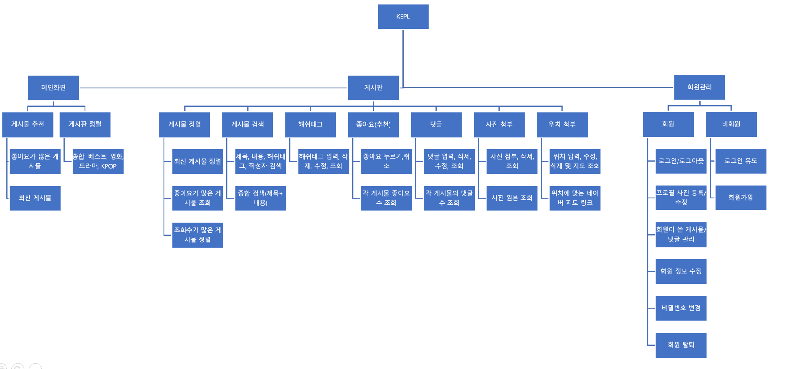

### 웹 페이지 별 기능 Summary

#### 1. 메인화면

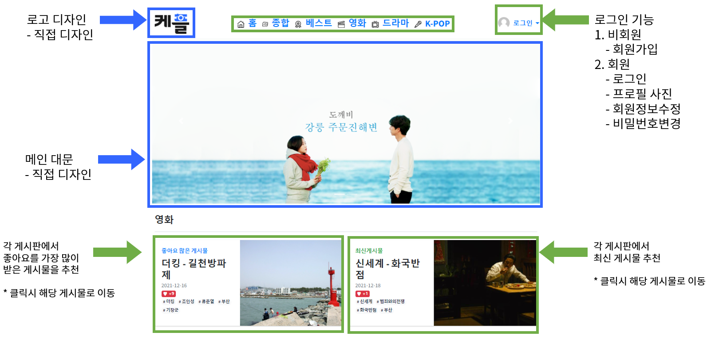

#### 2. 로그인 및 회원정보

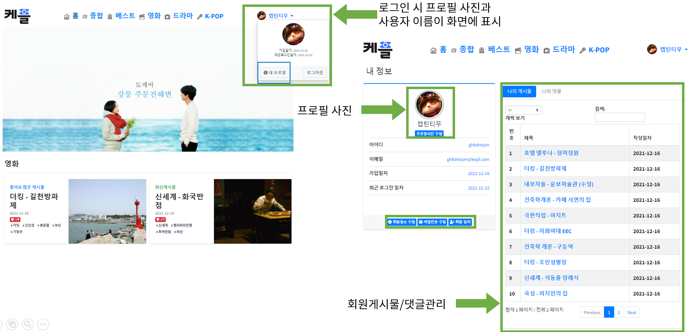

#### 3. 게시판 목록

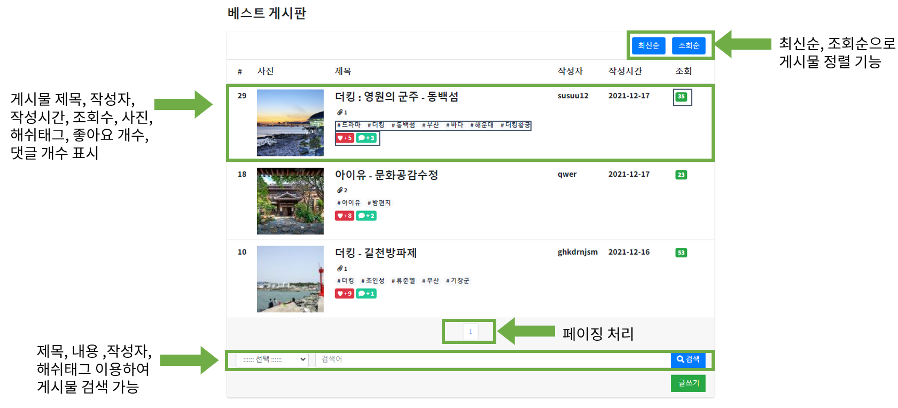

#### 4. 게시물 읽기, 좋아요, 댓글쓰기

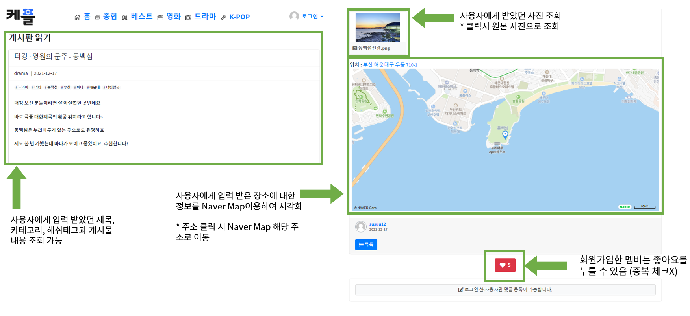

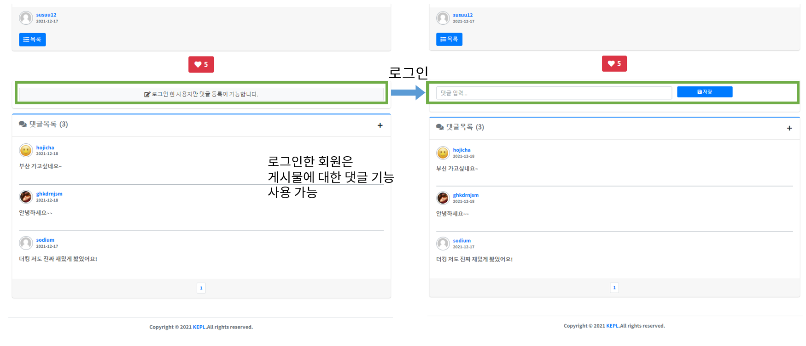

