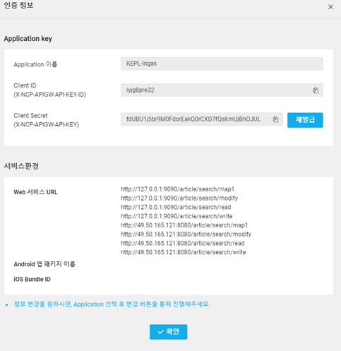
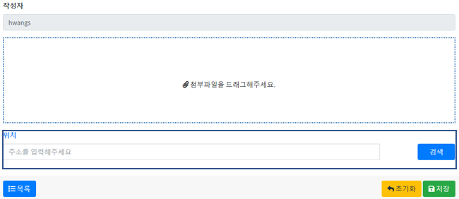
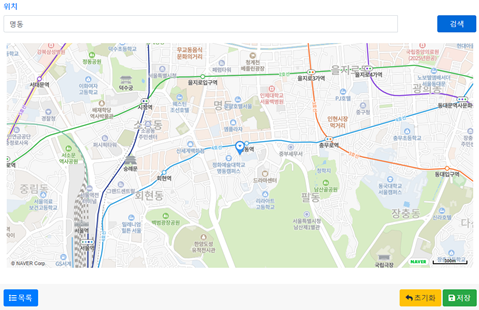
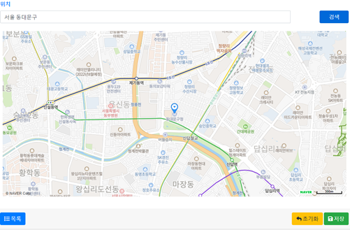
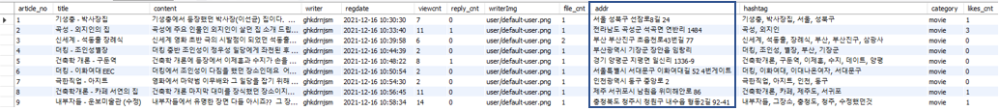
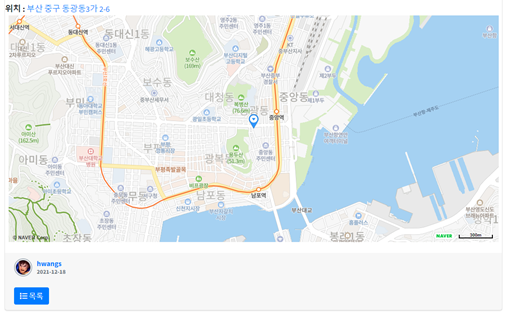
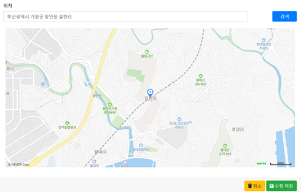

# 네이버 지도 기능


## 기본사항

Mysql tb_article table에 addr column 추가

artcleMapper.xml에 create, read, update에 addr 항목 추가

articleMapper.xml에 ArticleResultMap에 addr 추가 (추가 안해도 될수도 있음)


Naver cloud platform - AI, NaverAPI  - Application - Application 등록 및 'Web Dynamic Map', 'Geocoding' Service 필요

Application 서비스 환경의 사Web 서비스 URL에 사용하고자 하는 url 주소 등록 되어 있어야 함




## NaverMap Create


### View

주소 입력을 위한 input 생성

```jsp
<div class="form-group">
	<label for="content"><a href="https://map.naver.com/" target="_blank">위치 </a></label>
	<div class="input-group">
		<input class="form-control input-sm col-md-10" type="text" name="addr" id="addr" size="30" placeholder="주소를 입력해주세요">
			<div class="col-md-1"></div>
				<button class="btn btn-primary col-md-1" type="button" name="send" id="sendMark">검색</button>
	</div>
	
    <div class="container-md map">

	</div>
</div>
```




### Javascript

> input 창에 주소를 입력 후 검색을 누르면 검색 버튼과 저장 버튼 사이에 지도창이 생긴 후 입력 위치에 대한 마커가 생긴다.



```js
<script type="text/javascript" src="${path}/resources/js/jquery-3.6.0.min.js"></script>
<script type="text/javascript" src="https://openapi.map.naver.com/openapi/v3/maps.js?ncpClientId=클라이언트ID"></script>

//클라이언트ID는 Naver cloud 에서 발급 받은 ID를 입력해야 한다.

<script type="text/javascript">
	$(document).ready(function(){
		var i=0;	//지도 중복 생성을 막기 위한 변수
		
		$('#sendMark').click(function(){                                            
				event.preventDefault();
				
				if(i==0){
					$(".map").append("<br>");
					$(".map").append('<div id="map" style="width:100%;height:500px;"></div>');
					i++;
                    
                    //class = map tag에 지도를 입력할 수 있는 태그 추가됨
                    //이 코드가 없으면 지도 입력 후 그 밑에 지도가 추가로 생성되는 일이 발생함
                }
				
			$.ajax({
		         type:"get",
		         url:"map1",
		         contentType: "application/json",
		         data :{"addr":$("#addr").val()},
			     success:function (data,textStatus){
			    	  resultText = JSON.parse(data);
			    	  var lang1 = resultText.addresses[0].x;
			    	  var lat1 = resultText.addresses[0].y;
			    	  $('#span_lat').text(lat1);
			    	  $('#span_lang').text(lang1);
			    	  var mapOptions = {
							    center: new naver.maps.LatLng(lat1, lang1),
							    zoom: 15
							};
					var map = new naver.maps.Map('map', mapOptions);
					var marker = new naver.maps.Marker({
					    position: new naver.maps.LatLng(lat1, lang1),
					    map: map
					}); 
			     },
			     error:function(data,textStatus){
			        alert("에러가 발생했습니다.");
			     },
			     complete:function(data,textStatus){
			    	 
			     }
			  });
			
			var mapOptions = {
			    center: new naver.maps.LatLng(lat, lang),
			    zoom: 15
			};
			var map = new naver.maps.Map('map', mapOptions);
			var marker = new naver.maps.Marker({
			    position: new naver.maps.LatLng(lat, lang),
			    map: map
			}); 
		});
	});
</script>
```

주소를 입력한 후 검색을 누르면 그 주소 문자열을 {"addr" : "주소값"} JSON 데이터로 만든 후 map1 url(Controller)로 보낸다.


#### Controller.java

```java
	@ResponseBody	//ajax를 위한 ResponseBody 어노테이션
	@RequestMapping(value="/map1", method=RequestMethod.GET, produces = "application/text; charset=UTF-8")
	public void getGeo(HttpServletRequest req, HttpServletResponse res) throws IOException {
		req.setCharacterEncoding("utf-8");
		String addr = req.getParameter("addr");
		
		res.setContentType("text/text; charset=utf-8");
		String result = articleService.geocode(addr);
		
		res.getWriter().print(result);
	}
```

Key가 addr인 데이터를 String addr 변수에 담고 그 값을 aritcleServcie.geocode에 파라미터로 보낸다. (return 값은 String result에 담는다.)


#### Service.java

```java
	public String geocode(String words) {	//String words = Controller에서 String addr 
		 StringBuffer res = null;
		 String clientId = "lyjg8pre32";									//clientId -> Naver cloud 에서 발급 받은 ID를 입력
	     String clientSecret = "fdUBU1j5br9M0FdorEakQ0rCXD7fQsKmUjBhOJUL";  //Secret -> Naver cloud 에서 발급 받은 Secret를 입력
	     try {
	         String text = URLEncoder.encode(words, "UTF-8");				//입력값을 UTF-8로 인코딩 후 String text에 담기
	         String apiURL = "https://naveropenapi.apigw.ntruss.com/map-geocode/v2/geocode?query=" + text;	
	         URL url = new URL(apiURL);
	         HttpURLConnection con = (HttpURLConnection)url.openConnection();
	         con.setRequestProperty("X-NCP-APIGW-API-KEY-ID", clientId);
	         con.setRequestProperty("X-NCP-APIGW-API-KEY", clientSecret);
	         con.setDoOutput(true);

	         int responseCode = con.getResponseCode();
	         BufferedReader br;
	         if(responseCode==200) { 
	             br = new BufferedReader(new InputStreamReader(con.getInputStream(),"utf8"));
	         } else {
	             br = new BufferedReader(new InputStreamReader(con.getErrorStream()));
	         }
	         String inputLine;
	         res = new StringBuffer();
	         while ((inputLine = br.readLine()) != null) {
	             res.append(inputLine);
	         }
	         br.close();
	         System.out.println("service "+res.toString());
	     } catch (Exception e) {
	         System.out.println(e);
	     }
		
	
		return res.toString();
	}
```

입력받은 값을 UTF-8로 인코딩 후 String text에 담고 네이버에서 지정한 apiURL과 text를 조합한 후 clientId와 clientSecret을 헤더에 담아서 HttpURL 객체로 해당 내용을 요청한다.

응답한 코드가 200이면 BufferedReader br에 해당 내용을 담은 후 다시 StringBuffer res에 담고 res.toString 값을 Controller로 리턴해준다. (Json값)

Controller에서 받은 String result를 res.getWriter().print(result); 해준다. (request 객체를 보낸 곳으로 데이터 전달)


### Javascript

map1에서 ajax로 받은 위도, 경도 값을 가지고 Javascript로 돌아온다.

```js
// 위에 javascript코드와 동일한 코드이니 $.ajax 부터 설명합니다.
			$.ajax({
		         type:"get",
		         url:"map1",
		         contentType: "application/json",
		         data :{"addr":$("#addr").val()},
			     success:function (data,textStatus){
			    	  resultText = JSON.parse(data);
			    	  var lang1 = resultText.addresses[0].x;
			    	  var lat1 = resultText.addresses[0].y;
			    	  var mapOptions = {
							    center: new naver.maps.LatLng(lat1, lang1),
							    zoom: 15
							};
					var map = new naver.maps.Map('map', mapOptions);
					var marker = new naver.maps.Marker({
					    position: new naver.maps.LatLng(lat1, lang1),
					    map: map
					}); 
			     },
			     error:function(data,textStatus){
			        alert("에러가 발생했습니다.");
			     },
			     complete:function(data,textStatus){
			    	 
			     }
			  });
			
			var mapOptions = {
			    center: new naver.maps.LatLng(lat, lang),
			    zoom: 15
			};
			var map = new naver.maps.Map('map', mapOptions);
			var marker = new naver.maps.Marker({
			    position: new naver.maps.LatLng(lat, lang),
			    map: map
			}); 
		});
	});
</script>
```

Controller에서 받은 Json 값은 파싱하여 resultText 변수에 담고 (JSON에 많은 데이터를 담고 있는데, 우리에게 필요한 건 위도와 경도 데이터 뿐)

var lang1, var lat1 변수에 각각 위도와 경도 데이터를 담은 후 그 위치에 맞는 곳을 네이버API를 통해서 마커와 함께 보여준다.




게시물 입력 시 input 창에 입력된 주소는 addr 이름으로 ArticleVO에 담겨 controller로 가서 문자열로 DB에 저장된다.




## NaverMap Read

DB에 저장된 addr 문자열을 가지고 read.jsp로 온다.


### View

```jsp
<div class="box-footer location">
	<h2 class="card-title"> <b>위치 : </b> <a href="https://map.naver.com/v5/search/${article.addr}" target="_blank">${article.addr}</a></h2> <!--addr과 url를 결합해서 사용자가 위치클릭시 네이버 map으로 갈 수 있도록 -->
		<input type="hidden" id="addr" name="addr" value="${article.addr}">
			<div class="container-md map">
				<br>
				<div id="map" style="width:100%;height:500px;"></div>
			</div>
			<br>
</div>
```


### Javascript

```js
<script type="text/javascript" src="${path}/resources/js/jquery-3.6.0.min.js"></script>
<script type="text/javascript" src="https://openapi.map.naver.com/openapi/v3/maps.js?ncpClientId=lyjg8pre32"></script>
<script type="text/javascript">
	$(document).ready(function(){
        var address = $("#addr").val();
        
        //주소값이 없으면 div 태그에 id=map 인 태그 삭제, location 클래스 태그 삭제
		if (!address) {
            $("div").remove("#map");
            $("div").remove(".location");
            return;
        } 
		
		$.ajax({
	         type:"get",
	         url:"map1",
	         contentType: "application/json",
	         data :{"addr":$("#addr").val()},
		     success:function (data,textStatus){
		    	
		    	  resultText = JSON.parse(data);
		    	  //text = resultText.results[0].region.area1.name+","+resultText.results[1]
		    	  var lang1 = resultText.addresses[0].x;
		    	  var lat1 = resultText.addresses[0].y;
		    	  var mapOptions = {
						    center: new naver.maps.LatLng(lat1, lang1),
						    zoom: 15
						};
				var map = new naver.maps.Map('map', mapOptions);
				var marker = new naver.maps.Marker({
				    position: new naver.maps.LatLng(lat1, lang1),
				    map: map
				}); 
		     },
		     error:function(data,textStatus){
		        alert("에러가 발생했습니다.");
		     },
		     complete:function(data,textStatus){
		    	 
		     }
		  });
		
		var mapOptions = {
		    center: new naver.maps.LatLng(lat, lang),
		    zoom: 15
		};
		var map = new naver.maps.Map('map', mapOptions);
		var marker = new naver.maps.Marker({
		    position: new naver.maps.LatLng(lat, lang),
		    map: map
		}); 
	});
</script>
```

주소값이 없으면 div 태그에 id=map 인 태그 삭제, location 클래스 태그 삭제해서 사용자가에게 보여주고

주소값이 있다면 ajax 위의 Controller, Service의 과정을 거쳐 사용자에게 지도 위치를 보여준다.




## NaverMap Update

DB에 저장된 addr 문자열을 가지고 modify.jsp로 온다.


### View

```jsp
<div class="form-group">
	<label for="content">위치 </label>
		<div class="input-group">
			<input class="form-control input-sm col-md-10" type="text" name="addr" id="addr" size="30" placeholder="주소를 입력해주세요" value="${article.addr}">
			<div class="col-md-1"></div>
				<button class="btn btn-primary col-md-1" type="button" name="send" id="sendMark">검색</button>
		</div>

    <div class="container-md map">
    </div>
</div>
```


#### Javascript

```js
<script type="text/javascript" src="${path}/resources/js/jquery-3.6.0.min.js"></script>
<script type="text/javascript" src="https://openapi.map.naver.com/openapi/v3/maps.js?ncpClientId=lyjg8pre32"></script>
<script>
function viewMap(){
	$.ajax({
		type:"get",
		url:"map1",
		 contentType: "application/json",
         data :{"addr":$("#addr").val()},
         success:function (data,textStatus){
	    	  resultText = JSON.parse(data);
	    	  var lang1 = resultText.addresses[0].x;
	    	  var lat1 = resultText.addresses[0].y;
	    	  var mapOptions = {
					    center: new naver.maps.LatLng(lat1, lang1),
					    zoom: 15
					};
			var map = new naver.maps.Map('map', mapOptions);
			var marker = new naver.maps.Marker({
			    position: new naver.maps.LatLng(lat1, lang1),
			    map: map
			}); 
	     },
	     error:function(data,textStatus){
		        alert("에러가 발생했습니다.");
		     },
		     complete:function(data,textStatus){
		    	 
		    }
	});
}
</script>
<script type="text/javascript">
	$(document).ready(function(){
		var i=0;
		var mapValue=$("#addr").val();
		
		if(typeof mapValue == "underfined" || mapValue == null || mapValue == "" ){
			
		} else{
			$(".map").append("<br>");
			$(".map").append('<div id="map" style="width:100%;height:500px;"></div>');
			i++;
			viewMap();
		}
		
		$('#sendMark').click(function(){
				event.preventDefault();
				if(i==0){
					$(".map").append("<br>");
					$(".map").append('<div id="map" style="width:100%;height:500px;"></div>');
					i++;
				}
			$.ajax({
		         type:"get",
		         url:"map1",
		         contentType: "application/json",
		         data :{"addr":$("#addr").val()},
			     success:function (data,textStatus){
			    	  resultText = JSON.parse(data);
			    	  var lang1 = resultText.addresses[0].x;
			    	  var lat1 = resultText.addresses[0].y;
			    	  var mapOptions = {
							    center: new naver.maps.LatLng(lat1, lang1),
							    zoom: 15
							};
					var map = new naver.maps.Map('map', mapOptions);
					var marker = new naver.maps.Marker({
					    position: new naver.maps.LatLng(lat1, lang1),
					    map: map
					}); 
			     },
			     error:function(data,textStatus){
			        alert("에러가 발생했습니다.");
			     },
			     complete:function(data,textStatus){
			    	 
			     }
			  });
			
			var mapOptions = {
			    center: new naver.maps.LatLng(lat, lang),
			    zoom: 15
			};
			var map = new naver.maps.Map('map', mapOptions);
			var marker = new naver.maps.Marker({
			    position: new naver.maps.LatLng(lat, lang),
			    map: map
			}); 
		});
	});
</script>
```

주소값이 없다면 아무일도 일어나지 않고 

주소값이 있다면 ajax 위의 Controller, Service의 과정을 거쳐 사용자에게 지도 위치를 보여준다.





사용자가 위치를 수정하고자 주소를 입력한 후 검색을 누르면 지도의 위치가 바뀌고

수정을 누르면 수정된 값이 DB에 저장된다.


## NaverMap Delete

게시물을 삭제하거나 위치에 아무것도 입력하지 않고 수정을 누르면 삭제된다.


## 주의 사항

정확한 위치를 입력해야 한다. ex) 부산광역시 기장군 장안읍 길천리

잘못된 예) 서울시청, 서울타워, 부산시청 등등
