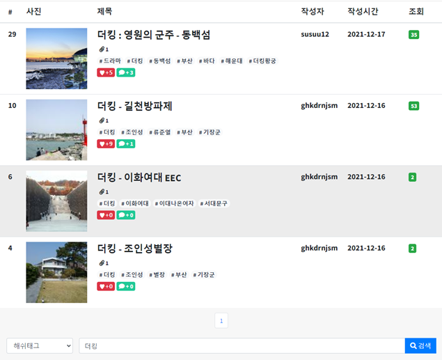

# 페이징 처리, 검색 기능


## 기본사항

페이징 처리, 검색 기능은 GET 방식을 사용하며, 페이징 처리시 필요한 페이지 번호만을 제공해야 합니다.

ex) 총 51개의 게시물이 존재하고 페이지당 10개 게시물을 보여주기로 했다면, 6페이지까지 화면에 출력되어야 한다는 것

get방식 예시) http://49.50.165.121:8080/article/search/list?page=1&perPageNum=10&searchType=t&keyword=IU


## 페이징 처리


### SQL (articleMapper.xml)

페이지 처리를 위한 SQL문 = `LIMIT` 키워드 사용해서

시작 데이터와 출력할 데이터의 갯수를 지정해야 합니다.

KEPL에서 사용하는 SQL문에서는 pageStart, perPageNum을 입력 받습니다. (SearchCriteria 객체를 입력받아서)

```sql
<select id="listSearch" resultMap="ArticleResultMap">
	<![CDATA[
	 SELECT
        ta.article_no,
        title,
        content,
        writer,
      	regdate,
       	viewcnt, 
        file_cnt,
        reply_cnt,
        hashtag,
        fullname,
        likes_cnt
    from tb_article as ta
	left join tb_article_file as taf on ta.article_no = taf.article_no
        WHERE ta.article_no > 0 
    ]]>
	<include refid="search" />
    <![CDATA[
    group by title
    ORDER BY article_no DESC, regdate DESC 
    LIMIT #{pageStart}, #{perPageNum}
    ]]>
</select>
```


### Criteria.java

> pageStart와 perPageNum을 설정하기 위한 Criteria.java

```java
public class Criteria {

    private int page;
    private int perPageNum;

    public Criteria() {
        this.page = 1;
        this.perPageNum = 10;
    }

    public void setPage(int page) {

        if (page <= 0) {
            this.page = 1;
            return;
        }

        this.page = page;
    }

    public int getPage() {
        return page;
    }

    public void setPerPageNum(int perPageNum) {

        if (perPageNum <= 0 || perPageNum > 100) {
            this.perPageNum = 10;
            return;
        }

        this.perPageNum = perPageNum;
    }

    public int getPerPageNum() {
        return this.perPageNum;
    }

    public int getPageStart() {
        return (this.page - 1) * perPageNum;
    }
    
    @Override
    public String toString() {
   	return "Criteria [page=" + page + ", perPageNum="+ perPageNum+"]" ;
    }
}
```


### SearchCriteria.java

> Criteria를 상속한 SearchCriteria (검색을 위한 searchType과 keyword)

```java
public class SearchCriteria extends Criteria {

        private String searchType;
        private String keyword;

		//searchType, keyword의 getter, setter, toString 추가하십시오.
}

```


### PageMaker.java

> 화면 하단의 페이지 번호를 출력을 위한 클래스

```java
public class PageMaker {

    private int totalCount;
    private int startPage;
    private int endPage;
    private boolean prev;
    private boolean next;

    private int displayPageNum = 10; // 하단 페이지 번호의 갯수

    private Criteria criteria;

    public void setCriteria(Criteria criteria) {
        this.criteria = criteria;
    }

    public void setTotalCount(int totalCount) {
        this.totalCount = totalCount;
        calcData();
    }
 
    // 게시글의 전체 갯수가 결정되면 calcData 메소드를 호출하여 계산 실행
    private void calcData(){
        //ceil = 올림 ex) 1 -> 10, 9 -> 10, 11 -> 20, 19 -> 20 ...
		endPage = (int) (Math.ceil(criteria.getPage() / (double) displayPageNum) *	displayPageNum); 	

        startPage = (endPage - displayPageNum) + 1;

        // 끝 페이지 번호 = Math.ceil(전체 게시글 수 / 페이지 당 출력할 게시글의 갯수)
        int tempEndPage = (int) (Math.ceil(totalCount / (double) criteria.getPerPageNum()));

        if (endPage > tempEndPage) {
            endPage = tempEndPage;
        }

        // 시작 페이지 번호가 1이면 false 아니면 true
        prev = startPage == 1 ? false : true;

        // ex) 끝 번호가 10 * 페이지 번호 갯수가 10 이고 전체 게시글 숫자가 100미만 이라면 false, true
        next = endPage * criteria.getPerPageNum() >= totalCount ? false : true;
    }
    
    // page 번호만 주면 url을 만들어 주는 코드 (page, perPageNum)
  	public String makeQuery(int page) {
        UriComponents uriComponents = UriComponentsBuilder.newInstance()
                .queryParam("page", page)
                .queryParam("perPageNum", criteria.getPerPageNum())
                .build();

        return uriComponents.toUriString();
    }
    
   // 페이징 + 검색 url을 만들어주는 코드 (page, perPageNum, searchType, keyword)
   public String makeSearch(int page) {

        UriComponents uriComponents = UriComponentsBuilder.newInstance()
                .queryParam("page", page)
                .queryParam("pagePageNum", criteria.getPerPageNum())
                .queryParam("searchType", ((SearchCriteria) criteria).getSearchType())
                .queryParam("keyword", encoding(((SearchCriteria) criteria).getKeyword()))
                .build();

        return uriComponents.toUriString();
    }
    
    //totalCount,startPage, endPage, prev, next에 대한 Getter, Setter
    //toString 추가 하셔야합니다.
    
}
    
```

**시작 페이지 번호** : 하단에 출력할 페이지 번호의 갯수가 10이고, 현재 페이지 번호가 1~10사이라면 시작번호는 1이어야한다.

**끝 페이지 번호** : 만약 전체 게시글의 갯수가 만약 65개라면, 끝페이지 번호는 7이어야 한다. 

**전체 게시글의 갯수** : 끝 페이지의 번호 계산을 위해서는 전체 게시글의 전체 갯수가 반드시 필요하다.

**이전 페이지 링크** : 시작 페이지 번호가 1이 아니라면 이전 페이지를 조회 할 수 있어야 한다.

**다음 페이지 링크** : 끝 페이지의 번호 이후에 더 많은 게시글이 존재한다면 다음 페이지를 조회 할 수 있어야 한다.

참고 url

https://walbatrossw.github.io/spring-mvc/2018/03/02/07-spring-mvc-board-paging-control-presentation.html#3-%EB%AA%A9%EB%A1%9D-%ED%95%98%EB%8B%A8%EC%9D%98-%ED%8E%98%EC%9D%B4%EC%A7%80-%EB%B2%88%ED%98%B8-%EC%B6%9C%EB%A0%A5%EC%9D%84-%EC%9C%84%ED%95%9C-%EA%B3%84%EC%82%B0%EC%8B%9D-%EC%A0%95%EB%A6%AC


### SQL (articleMapper.xml)

전체 게시물의 총합이 필요한 상황에서 SQL문으로 총합을 가져와야 한다.

Service, DAO에서의 파라미터는 Criteria 객체 필요

```xml
	<select id="countArticles" resultType="int">
    <![CDATA[
    SELECT
        COUNT(article_no)
    FROM tb_article
    WHERE article_no > 0
    ]]>
	</select>

```


### Controller.java

```java
    @RequestMapping(value = "/list", method = RequestMethod.GET)
    public String list(@ModelAttribute("searchCriteria") SearchCriteria searchCriteria, Model model) 
						throws Exception {

        logger.info("search list() called ...");
        
        PageMaker pageMaker = new PageMaker();
        pageMaker.setCriteria(searchCriteria);
        pageMaker.setTotalCount(articleService.countSearchedArticles(searchCriteria));
        
		model.addAttribute("articles", articleService.listSearch(searchCriteria));

        model.addAttribute("pageMaker", pageMaker);

        
   		return "article/search/list";
	}
```

pageMaker 생성 후에 setCriteria, setTotalCount 한 후 "pageMaker" Key로 pageMaker를 리턴한다.


### list.jsp

```jsp
<div class="card-footer">
    <nav aria-label="Contacts Page Navigation">
        <ul class="pagination justify-content-center m-0">
            <c:if test="${pageMaker.prev}">
            	<li class="page-item"><a class="page-link"
            	href="${path}/article/search/list${pageMaker.makeSearch(pageMaker.startPage - 1)}">이전</a></li>
            </c:if>
            <c:forEach begin="${pageMaker.startPage}" end="${pageMaker.endPage}" var="idx">
            	<li class="page-item"
            	<c:out value="${pageMaker.criteria.page == idx ? 'class=active' : ''}"/>>
            	<a class="page-link" href="${path}/article/search/list${pageMaker.makeSearch(idx)}">${idx}</a>
            	</li>
            </c:forEach>
            <c:if test="${pageMaker.next && pageMaker.endPage > 0}">
            	<li class="page-item"><a class="page-link"
            	href="${path}/article/search/list?${pageMaker.makeSearch(pageMaker.endPage + 1)}">다음</a></li>
            </c:if>
        </ul>
    </nav>
</div>
```

pageMaker.prev (시작 페이지 번호가 1이면 false 아니면 true) 이전 버튼 생성

pageMaker.startPage 부터 endPage 까지 버튼 생성

pageMaker.next(끝 번호 * 페이지 번호 >= 전체 게시글 숫자 false 아니면 true) and pageMaker.endPage > 0 이면 다음 버튼 생성


## 검색 기능


### list.jsp (View)

```jsp
<div class="row">
	<div class="form-group col-sm-2">
		<select class="form-control" name="searchType" id="searchType">
			<option value="n"
				<c:out value="${searchCriteria.searchType == null ? 'selected' : ''}"/>>::::::선택 ::::::</option>
				<option value="t" <c:out value="${searchCriteria.searchType eq 't' ? 'selected' : ''}"/>>제목</option>						<option value="c" <c:out value="${searchCriteria.searchType eq 'c' ? 'selected' : ''}"/>>내용</option>
				<option value="w" <c:out value="${searchCriteria.searchType eq 'w' ? 'selected' : ''}"/>>작성자</option>
				<option value="h" <c:out value="${searchCriteria.searchType eq 'h' ? 'selected' : ''}"/>>해쉬태그</option>
				<option value="tc"<c:out value="${searchCriteria.searchType eq 'tc' ? 'selected' : ''}"/>>제목+내용</option>
				<option value="cw"<c:out value="${searchCriteria.searchType eq 'cw' ? 'selected' : ''}"/>>내용+작성자</option>
				<option value="tcw"<c:out value="${searchCriteria.searchType eq 'tcw' ? 'selected' : ''}"/>>제목+내용+작성자					</option>
											
		</select>
	</div>
<div class="form-group col-sm-10">
	<div class="input-group">
		<input type="text" class="form-control" name="keyword" id="keywordInput" value="${searchCriteria.keyword}" placeholder="검색어"> <span class="input-group-append">
                        <button type="button" class="btn btn-primary btn-flat" id="searchBtn">
                            <i class="fa fa-search"></i> 검색
                        </button>
					</span>
	</div>
</div>
```


### JavaScript

```js
    $("#searchBtn").on("click", function (event) {
        self.location =
            "${path}/article/search/list${pageMaker.makeQuery(1)}"
            + "&searchType=" + $("select option:selected").val()
            + "&keyword=" + encodeURIComponent($("#keywordInput").val());
    });
```

검색 버튼을 누르면 

PagerMaker에서 만들었던 makeQuery 코드 + searchType (검색내용) + keyword(검색어) 조한 url로 이동 할 수 있도록 한다.


### SQL (articleMapper.xml)

코드가 길기 때문에 search라는 id로 sql if문을 만들어놓았다.

이걸 list 조회 기능문 (listSearch, listSearchMovie, listSearchBest) 사이에 `<include refid="search" />` 를 통해 넣어놓았다.

```xml
	<sql id="search">
		<if test="searchType != null">
			<if test="searchType == 't'.toString()">
				AND title LIKE CONCAT('%', #{keyword}, '%')
			</if>
			<if test="searchType == 'c'.toString()">
				AND content LIKE CONCAT('%', #{keyword}, '%')
			</if>
			<if test="searchType == 'w'.toString()">
				AND writer LIKE CONCAT('%', #{keyword}, '%')
			</if>
			<if test="searchType == 'h'.toString()">
				AND hashtag LIKE CONCAT('%', #{keyword}, '%')
			</if>
			<if test="searchType == 'tc'.toString()">
				AND (
				title LIKE CONCAT('%', #{keyword}, '%')
				OR content LIKE CONCAT('%', #{keyword}, '%')
				)
			</if>
			<if test="searchType == 'cw'.toString()">
				AND (
				content LIKE CONCAT('%', #{keyword}, '%')
				OR writer LIKE CONCAT('%', #{keyword}, '%')
				)
			</if>
			<if test="searchType == 'tcw'.toString()">
				AND (
				title LIKE CONCAT('%', #{keyword}, '%')
				OR content LIKE CONCAT('%', #{keyword}, '%')
				OR writer LIKE CONCAT('%', #{keyword}, '%')
				)
			</if>
		</if>
	</sql>
```

입력받았던 SearchType에 따라 sql문이 실행된다.

​	※ sql문 사이에 '%' 은 아무 문자열이 와도 상관 없다는 뜻(?) 정도로 해석하면 된다.

​	※ ex ) `('%', #{keyword}, '%')` = 앞, 뒤 아무 문자열 상관 없이 입력받은 키워드랑 같은 문자열을 가진 것



