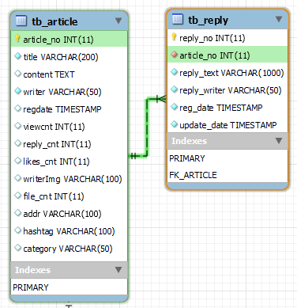

# 댓글 기능

##### 1. 댓글기능을 위한 테이블 생성



###### 1.1 테이블을 생성하고 댓글 참조키 설정

```java
CREATE TABLE tb_reply ( 
 reply_no INT NOT NULL AUTO_INCREMENT,
 article_no INT NOT NULL DEFAULT 0,
 reply_text VARCHAR(1000) NOT NULL,
 reply_writer VARCHAR(50) NOT NULL,
 reg_date TIMESTAMP NOT NULL DEFAULT NOW(),
 update_date TIMESTAMP NOT NULL DEFAULT NOW(),
 PRIMARY KEY (reply_no) 
); 

ALTER TABLE tb_article ADD COLUMN reply_cnt int DEFAULT 0;

ALTER TABLE tb_reply ADD CONSTRAINT FK_ARTICLE 
FOREIGN KEY (article_no) REFERENCES tb_article (article_no);
```

###### 1.2 댓글을 위한 ReplyVO 객체 생성

```java
public class ReplyVO {

    private Integer reply_no;
    private Integer article_no;
    private String reply_text;
    private String reply_writer;
    private Date reg_date;
    private Date update_date;
    private ArticleVO articleVO;
    private UserVO userVO;
    
	
	public ArticleVO getArticleVO() {
		return articleVO;
	}
	public void setArticleVO(ArticleVO articleVO) {
		this.articleVO = articleVO;
	}
	public Integer getReply_no() {
		return reply_no;
	}
	public void setReply_no(Integer reply_no) {
		this.reply_no = reply_no;
	}
	public Integer getArticle_no() {
		return article_no;
	}
	public void setArticle_no(Integer article_no) {
		this.article_no = article_no;
	}
	
	public String getReply_text() {
		return reply_text;
	}
	public void setReply_text(String reply_text) {
		this.reply_text = reply_text;
	}
	public String getReply_writer() {
		return reply_writer;
	}
	public void setReply_writer(String reply_writer) {
		this.reply_writer = reply_writer;
	}
	public Date getReg_date() {
		return reg_date;
	}
	public void setReg_date(Date reg_date) {
		this.reg_date = reg_date;
	}
	public Date getUpdate_date() {
		return update_date;
	}
	public void setUpdate_date(Date update_date) {
		this.update_date = update_date;
	}
	
	
	public UserVO getUserVO() {
		return userVO;
	}
	public void setUserVO(UserVO userVO) {
		this.userVO = userVO;
	}
	@Override
	public String toString() {
		return "ReplyVO [reply_no=" + reply_no + ", article_no=" + article_no + ", reply_text=" + reply_text
				+ ", reply_writer=" + reply_writer + ", reg_date=" + reg_date + ", update_date=" + update_date
				+ ", articleVO=" + articleVO + ", userVO=" + userVO + "]";
	}
	

}
```


##### 2. ReplyDAO, ReplyDAOImpl, ReplyMapper 생성 및 작성 (Persistence 계층 구현)

###### 2.1 ReplyDAO 인터페이스 작성

```java
public interface ReplyDAO {


	public List<ReplyVO> list(Integer article_no) throws Exception ;
	
	void create(ReplyVO replyVO) throws Exception;
	
	void update(ReplyVO replyVO) throws Exception;
	
	void delete(Integer reply_no) throws Exception;
	
	List<ReplyVO> listPaging(Integer article_no, Criteria criteria) throws Exception;
	
	int countReplies(Integer article_no) throws Exception;
	
	int getArticleNo(Integer reply_no) throws Exception;

	// 회원이 작성한 댓글 목록
	List<ReplyVO> userReplies(String userId) throws Exception;

}
```

###### 2.2 ReplyDAOImpl 클래스 작성

```java
@Repository
public class ReplyDAOImpl implements ReplyDAO {

    private static String NAMESPACE = "mc.sn.KEPL.mappers.reply.ReplyMapper";

    private final SqlSession sqlSession;

    @Inject
    public ReplyDAOImpl(SqlSession sqlSession) {
        this.sqlSession = sqlSession;
    }
    
    @Override
    public List<ReplyVO> list(Integer article_no) throws Exception {
        return sqlSession.selectList(NAMESPACE + ".list", article_no);
    }

    @Override
    public void create(ReplyVO replyVO) throws Exception {
        sqlSession.insert(NAMESPACE + ".create", replyVO);
    }

    @Override
    public void update(ReplyVO replyVO) throws Exception {
        sqlSession.update(NAMESPACE + ".update", replyVO);
    }

    @Override
    public void delete(Integer reply_no) throws Exception {
        sqlSession.delete(NAMESPACE + ".delete", reply_no);
    }
    
    @Override
    public int getArticleNo(Integer reply_no) throws Exception {
        return sqlSession.selectOne(NAMESPACE + ".getArticleNo", reply_no);
    }
    
    @Override
    public List<ReplyVO> userReplies(String userId) throws Exception {
        return sqlSession.selectList(NAMESPACE + ".userReplies", userId);
    }
    
    
    @Override
    public List<ReplyVO> listPaging(Integer article_no, Criteria criteria) throws Exception {

        Map<String, Object> paramMap = new HashMap<String, Object>();
        paramMap.put("article_no", article_no);
        paramMap.put("criteria", criteria);

        return sqlSession.selectList(NAMESPACE + ".listPaging", paramMap);
    }

    @Override
    public int countReplies(Integer article_no) throws Exception {
        return sqlSession.selectOne(NAMESPACE + ".countReplies", article_no);
    }
}
```

###### 2.3 ReplyMapper.xml 작성

```java
<mapper namespace="mc.sn.KEPL.mappers.reply.ReplyMapper">
	
	<select id="list" resultMap="ReplyResultMap">
        SELECT
          reply_no
          , article_no
          , reply_text
          , reply_writer
          , reg_date
          , update_date
        FROM tb_reply
        WHERE article_no = #{article_no}
        ORDER BY reply_no
    </select>
	
	<select id="listPaging" resultMap="ReplyResultMap">
	    SELECT
	        *
	    FROM tb_reply
	    INNER JOIN tb_user ON user_id = reply_writer
	    WHERE article_no = #{article_no}
	    ORDER BY reply_no DESC
	    LIMIT #{criteria.pageStart}, #{criteria.perPageNum}
	</select>
	
    <insert id="create">
        INSERT INTO tb_reply (
            article_no
            , reply_text
            , reply_writer
        ) VALUES (
            #{article_no}
            , #{reply_text}
            , #{reply_writer}
        )
    </insert>

    <update id="update">
        UPDATE tb_reply
        SET
            reply_text = #{reply_text}
            , update_date = NOW()
        WHERE reply_no = #{reply_no}
    </update>

    <delete id="delete">
        DELETE FROM tb_reply
        WHERE reply_no = #{reply_no}
    </delete>
    
    

	<select id="countReplies" resultType="int">
	    SELECT
	        COUNT(article_no)
	    FROM tb_reply
	    WHERE article_no = #{article_no}
	</select>
	
	<select id="getArticleNo" resultType="int">
	    SELECT
	        article_no
	    FROM tb_reply
	    WHERE reply_no = #{reply_no}
	</select>
	
	<!--회원이 작성한 댓글 목록-->
    <select id="userReplies" resultMap="ReplyResultMap">
        SELECT
            r.reply_text
            , r.reg_date
            , a.title
            , a.article_no
        FROM tb_reply r
            LEFT OUTER JOIN tb_article a
                ON a.article_no = r.article_no
        WHERE reply_writer = #{userId}
    </select>

    <resultMap id="ReplyResultMap" type="ReplyVO">
        <id property="reply_no" column="reply_no"/>
        <result property="article_no" column="article_no"/>
        <result property="reply_text" column="reply_text"/>
        <result property="reply_writer" column="reply_writer"/>
        <result property="reg_date" column="reg_date"/>
        <result property="update_date" column="update_date"/>        
        <association property="userVO" resultMap="userVOResultMap"/>
        <association property="articleVO" resultMap="ArticleResultMap"/>
    </resultMap>

    <resultMap id="ArticleResultMap" type="ArticleVO">
        <id property="article_no" column="article_no"/>
        <result property="title" column="title" />
        <result property="content" column="content" />
        <result property="writer" column="writer" />
        <result property="regDate" column="regdate" />
        <result property="viewCnt" column="viewcnt" />
        <result property="replyCnt" column="reply_cnt" />
        <result property="fileCnt" column="file_cnt" />
        <result property="writerImg" column="writerImg" />
        <association property="userVO" resultMap="userVOResultMap"/>
    </resultMap>
   
	<resultMap id="userVOResultMap" type="UserVO">
        <id property="userId" column="user_id"/>
        <result property="userPw" column="user_pw"/>
        <result property="userName" column="user_name"/>
        <result property="userEmail" column="user_email"/>
        <result property="userJoinDate" column="user_join_date"/>
        <result property="userLoginDate" column="user_login_date"/>
        <result property="userSignature" column="user_signature"/>
        <result property="userImg" column="user_img"/>
        <result property="userPoint" column="user_point"/>
        
    </resultMap>
    

    </mapper>
```

##### 3. mybatis-config 설정

###### 3.1 ReplyMapper.xml 에서 resultMap이나 resultType을 편하게 쓰기 위해 ReplyVO 를 alias 설정

```java
<configuration>

    <typeAliases>
        <typeAlias type="mc.sn.KEPL.VO.ArticleVO" alias="ArticleVO"/>        
        <typeAlias type="mc.sn.KEPL.VO.ReplyVO" alias="ReplyVO" />
        <typeAlias type="mc.sn.KEPL.VO.UserVO" alias="UserVO" />
    </typeAliases>


</configuration>
```

##### 4. ReplyService, ReplyServiceImpl 생성 및 작성 (Service 계층 구현)

##### 4.1 ReplyService 인터페이스 작성

```java
public interface ReplyService {

	List<ReplyVO> list(Integer article_no) throws Exception;

    void create(ReplyVO replyVO) throws Exception;

    void update(ReplyVO replyVO) throws Exception;

    void delete(Integer reply_no) throws Exception;
	
	// 회원이 작성한 댓글 목록
    List<ReplyVO> userReplies(String userId) throws Exception;
    
    List<ReplyVO> getRepliesPaging(Integer article_no, Criteria criteria) throws Exception;

    int countReplies(Integer article_no) throws Exception;
}
```

###### 4.2  ReplyServiceImpl 클래스 작성

```java
@Service
public class ReplyServiceImpl implements ReplyService {

    private final ReplyDAO replyDAO;
    private final ArticleDAO articleDAO;
    
    @Inject
    public ReplyServiceImpl(ReplyDAO replyDAO, ArticleDAO articleDAO) {
        this.replyDAO = replyDAO;
        this.articleDAO = articleDAO;
    }	

    @Override
    public void update(ReplyVO replyVO) throws Exception {
        replyDAO.update(replyVO);
    }
    
    // 댓글 등록
    @Transactional // 트랜잭션 처리
    @Override
    public void create(ReplyVO replyVO) throws Exception {
        replyDAO.create(replyVO); // 댓글 등록
        articleDAO.updateReplycnt(replyVO.getArticle_no(), 1);
    }

    // 댓글 삭제
    @Transactional // 트랜잭션 처리
    @Override
    public void delete(Integer reply_no) throws Exception {
        int article_no = replyDAO.getArticleNo(reply_no); // 댓글의 게시물 번호 조회
        replyDAO.delete(reply_no); // 댓글 삭제
        articleDAO.updateReplycnt(article_no, -1); // 댓글 갯수 감소
    }
    
    
    @Override
    public List<ReplyVO> list(Integer article_no) throws Exception {
        return replyDAO.list(article_no);
    }
    
    @Override
    public List<ReplyVO> getRepliesPaging(Integer article_no, Criteria criteria) throws Exception {
        return replyDAO.listPaging(article_no, criteria);
    }

    @Override
    public int countReplies(Integer article_no) throws Exception {
        return replyDAO.countReplies(article_no);
    }
    
 // 회원이 작성한 댓글 목록
    @Override
    public List<ReplyVO> userReplies(String userId) throws Exception {
        return replyDAO.userReplies(userId);
    }
}
```

##### 5. ReplyController 생성 및 작성

###### 5.1 ReplyController는 Rest방식을 사용해서 구현하도록 하겠습니다. Rest방식의 컨트롤러를 작성하기에 앞서 브라우저에서 PUT, PATCH, DELETE 전송방식을 지원하기 위해서는 web.xml 파일에 필터를 추가해 줘야합니다.

브라우저에 따라서 PUT, PATCH, DELETE 전송방식을 지원하지 않을 수 있기 때문에 브라우저에서 POST 방식으로 전송하지만, 추가적인 정보를 이용해 PUT, PATCH, DELETE와 같은 정보를 함께 전송하는 Overloaded POST를 사용하겠습니다. Overloaded POST는 <form> 태그를 사용해 데이터를 전송할 때 POST 방식으로 전송하고, 추가정보로 _method를 사용합니다. 

 Spring에서는 이러한 방식을 위해 HiddenHttpMethodFilter라는 것을 제공하고 있습니다. <form>태그 내에 <input type="hidden" name="_method" value="PUT">와 같은 형태로 사용함으로써 GET, POST방식만을 지원하는 브라우저에서 REST방식을 사용할 수 있게 되는 것입니다. 

###### 5.2 web.xml 수정

```java
<filter>
    <filter-name>hiddenHttpMethodFilter</filter-name>
    <filter-class>org.springframework.web.filter.HiddenHttpMethodFilter</filter-class>
</filter>
<filter-mapping>
    <filter-name>hiddenHttpMethodFilter</filter-name>
    <url-pattern>/*</url-pattern>
</filter-mapping>
```

###### 5.3 ReplyController 작성

```java
@RestController
@RequestMapping("/replies")
public class ReplyController {

    private final ReplyService replyService;

    @Inject
    public ReplyController(ReplyService replyService) {
        this.replyService = replyService;
    }
    
    //Reply Register
    @RequestMapping(value = "", method = RequestMethod.POST)
    public ResponseEntity<String> register(@RequestBody ReplyVO replyVO) {
        ResponseEntity<String> entity = null;
        try {
            replyService.create(replyVO);
            entity = new ResponseEntity<String>("regSuccess", HttpStatus.OK);
        } catch (Exception e) {
            e.printStackTrace();
            entity = new ResponseEntity<String>(e.getMessage(), HttpStatus.BAD_REQUEST);
        }
        return entity;
    }
    
    //Reply List
    @RequestMapping(value = "/all/{articleNo}", method = RequestMethod.GET)
    public ResponseEntity<List<ReplyVO>> list(@PathVariable("article_no") Integer article_no) {
        ResponseEntity<List<ReplyVO>> entity = null;
        try {
            entity = new ResponseEntity<List<ReplyVO>>(replyService.list(article_no), HttpStatus.OK);
        } catch (Exception e) {
            e.printStackTrace();
            entity = new ResponseEntity<List<ReplyVO>>(HttpStatus.BAD_REQUEST);
        }
        return entity;
    }
    
    //Reply Modify
    @RequestMapping(value = "/{reply_no}", method = {RequestMethod.PUT, RequestMethod.PATCH})
    public ResponseEntity<String> update(@PathVariable("reply_no") Integer reply_no, @RequestBody ReplyVO replyVO) {
        ResponseEntity<String> entity = null;
        try {
            replyVO.setReply_no(reply_no);
            replyService.update(replyVO);
            entity = new ResponseEntity<String>("modSuccess", HttpStatus.OK);
        } catch (Exception e) {
            e.printStackTrace();
            entity = new ResponseEntity<String>(e.getMessage(), HttpStatus.BAD_REQUEST);
        }
        return entity;
    }
    
    //Reply Delete
    @RequestMapping(value = "/{reply_no}", method = RequestMethod.DELETE)
    public ResponseEntity<String> delete(@PathVariable("reply_no") Integer reply_no) {
        ResponseEntity<String> entity = null;
        try {
            replyService.delete(reply_no);
            entity = new ResponseEntity<String>("delSuccess", HttpStatus.OK);
        } catch (Exception e) {
            e.printStackTrace();
            entity = new ResponseEntity<String>(e.getMessage(), HttpStatus.BAD_REQUEST);
        }
        return entity;
    }
  //Reply Paging List
    @RequestMapping(value = "/{article_no}/{page}", method = RequestMethod.GET)
    public ResponseEntity<Map<String, Object>> listPaging(@PathVariable("article_no") Integer article_no,
                                                          @PathVariable("page") Integer page) {

        ResponseEntity<Map<String, Object>> entity = null;

        try {

            Criteria criteria = new Criteria();
            criteria.setPage(page);

            List<ReplyVO> replies = replyService.getRepliesPaging(article_no, criteria);
            int repliesCount = replyService.countReplies(article_no);

            PageMaker pageMaker = new PageMaker();
            pageMaker.setCriteria(criteria);
            pageMaker.setTotalCount(repliesCount);

            Map<String, Object> map = new HashMap<String, Object>();
            map.put("replies", replies);
            map.put("pageMaker", pageMaker);

            entity = new ResponseEntity<Map<String, Object>>(map, HttpStatus.OK);

        } catch (Exception e) {

            e.printStackTrace();
            entity = new ResponseEntity<Map<String, Object>>(HttpStatus.OK);

        }

        return entity;
    }
    
  
}
```

