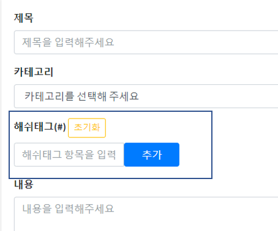
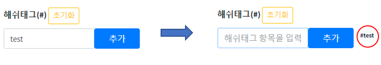
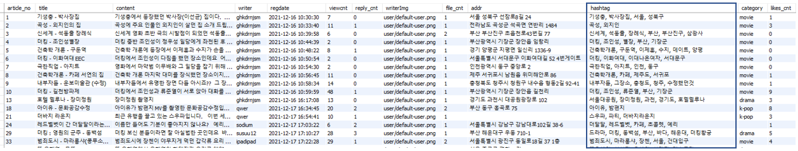
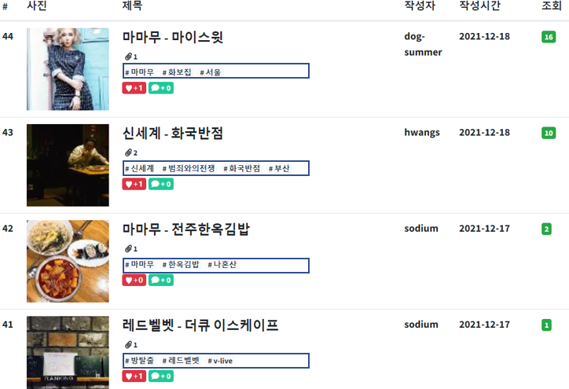
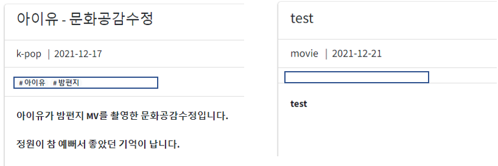
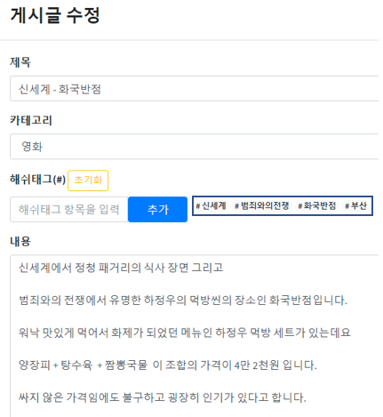

# HashTag 기능

> list, create, update에 해쉬태그 기능 추가


## 기본사항

Mysql tb_article table에 hashtag column 추가

articleMapper.xml에 create,read, update,  listSearch (kpop, drama,movie,best 포함)에 hashtag 항목 추가

articleMappler.xml에 ArticleResultMap에 hashtag 추가


## HashTag Create


### View

해쉬태그 입력을 위한 input 생성 -> 글쓰기 기능인 write.jsp에 카테고리와 내용 사이에 form-group으로 해쉬태그 창 추가

```jsp
<div class="form-group">
	<label for="title">해쉬태그(#) <button type="button" class="btn btn-outline-warning btn-sm">초기화</button></label> 
		<div class="input-group">
			<input class="form-control input-sm col-md-2" type="text" id="hashtag" placeholder="해쉬태그 항목을 입력해주세요">
				<button class="btn btn-primary col-md-1" type="button" id="btn_hash">추가</button>
					<div class="col-md-6" id="hashtagValue">						
						<input type="hidden" id="tagValue" name="hashtags" value="">
					</div>
				</div>
</div>
```




### JavaScript

해쉬태그 입력에 기능 추가

```js
<script>
$(document).ready(function() {
	
	var arr = new Array();
	
	$("#btn_hash").on("click", function () {
	    	
	   var test = $('#hashtag').val();
	    
	   if(arr.includes(test) == false){
		   arr.push(test);
		   
		   var html = '<span class="badge rounded-pill bg-light tags"> #';
		   html += test ;
		   html +="</span> &nbsp;";
		    $("#hashtagValue").append(html);
		    
		    $("#tagValue").val(arr);
	   } else{
		   alert("태그가 중복되었습니다.");
	   }
	});
	
	$(".btn-outline-warning").on("click", function () {
		$('span').remove(".tags");
		arr = [];
		$("#tagValue").val(arr);
		
	});
	
});
</script>
```

controller로 데이터를 전송하기 위한 배열(var arr)을 document 준비 시에 생성하고 추가 버튼을 누르면 hashtag input 창에 있던 내용이 var test 변수에 담긴다.

var arr 배열에 담겨져 있지 않은 값이면 var test 값을 var arr배열에 인덱스로 추가한다.



입력값이 나올 수 있게 var html에 입력값을 포함한 badge 생성코드를 입력 후 hashtagValue에 append 시키면 위와 같이 badge 코드가 생성된다.

controller값을 넘기기 위하여 var arr 배열을 Hidden input 태그 tagValue의 value로 저장된다.

​	※ 초기화 버튼 클릭시 입력받았던 badge 초기화 , var arr 배열 초기화, tagValue의 value 초기화


### Controller

```java
    @RequestMapping(value = "/write", method = RequestMethod.POST)
    public String writePOST(ArticleVO articleVO,
                            RedirectAttributes redirectAttributes,
                            @RequestParam("hashtags") String[] hashtags) throws Exception {

        logger.info("search writePOST() called...");
       
        String hashtag = Arrays.toString(hashtags);
           
        hashtag = hashtag.replace("[", "");
        hashtag = hashtag.replace("]", "");
        
        if(hashtag.equals("")) {
        	articleVO.setHashtag(null);
        } else {
        	articleVO.setHashtag(hashtag);
        }
        
        System.out.println(articleVO.toString());
        articleService.create(articleVO);
        redirectAttributes.addFlashAttribute("msg", "regSuccess");

        return "redirect:/article/search/list";
    }
```

글쓰기 입력창에서 입력 받은 정보들 중 hashtag 값을 String배열로 입력 받은 후 

mysql에서 배열자체로 데이터를 저장 할 수 없기 때문에 

배열을 String화 하여 저장한다.

String으로 저장하면 String 앞 부분과 뒷 부분에 [ ] 특수문자가 있기 때문에 replace로 지운 후 articleVO.setHashtag로 값을 입력 후 create한다. 

(hashtag값이 없으면 null)




MySQL에서 데이터 확인하면 배열이 String으로 저장된걸 확인 할 수 있다.


## HashTag Read

HashTag Read는 2곳에서 일어난다. 

게시물 읽은 때와 게시물을 나열 할 때인

read.jsp, list.jsp	(best, drama,kpop,movie도 포함되나 list로만 설명)


### list.jsp

```jsp
<br>
	<c:set var="hashtags" value="${fn:split(article.hashtag,', ')}"/>
	<c:set var="leng" value="${fn:length(hashtags)}"/>
														
	<c:if test="${leng>=1 and hashtags[0] ne ''}">
		<c:forEach var="i" begin="0" end="${leng-1}" step="1">
			<span class="badge rounded-pill bg-light"># ${hashtags[i]}</span>
		</c:forEach>
	</c:if>
<br>
```

MySQL에서 게시물의 hashtag값은 String으로 되어 있기 때문에 그걸 배열화하여 하나씩 꺼내야 된다.


#### JSTL 문법

`<c:set var="hashtags" value="${fn:split(article.hashtag,', ')}"/>` => article.hashtag의 string을 ',' 기준으로 hashtags 하나씩 담기(배열)

`<c:set var="leng" value="${fn:length(hashtags)}"/>` => hastags 배열의 길이(index 갯수)를 leng에 담기


```jsp
	<c:if test="${leng>=1 and hashtags[0] ne ''}">
		<c:forEach var="i" begin="0" end="${leng-1}" step="1">
			<span class="badge rounded-pill bg-light"># ${hashtags[i]}</span>
		</c:forEach>
	</c:if>
```

`<c:if> `  hastags 배열의 길이가 1 보다 크거나 같거나 hashtags배열의 0번째 인덱스 값이 ' '이 아니라면 		※ (ne = !=)

`<c:forEach>` for문 조건 (i=0, leng-1 , i++) 

  hashtags 배열의 [i] 번째 인덱스 값으로 badge 만들기

`<c:forEach>`




### read.jsp

```jsp
<c:set var="hashtags" value="${fn:split(article.hashtag,', ')}"/>
<c:set var="leng" value="${fn:length(hashtags)}"/>
									
	<c:choose>
		<c:when test="${leng>=1 and hashtags[0] ne ''}">
			<c:forEach var="i" begin="0" end="${leng-1}" step="1">
				<span class="badge rounded-pill bg-light"># ${hashtags[i]}</span>
			</c:forEach>
		</c:when>
		<c:when test="${leng<=1}">
											
		</c:when>
	</c:choose>
```

#### JSTL 문법

`<c:set var="hashtags" value="${fn:split(article.hashtag,', ')}"/>` => article.hashtag의 string을 ',' 기준으로 hashtags 하나씩 담기(배열)`

`<c:set var="leng" value="${fn:length(hashtags)}"/>` => hastags 배열의 길이(index 갯수)를 leng에 담기


`<c:choose>` = java elseif문과 비슷한 것

`<c:when>` hastags 배열의 길이가 1 보다 크거나 같거나 hashtags배열의 0번째 인덱스 값이 ' '이 아니라면 		※ (ne = !=)

`<c:forEach>` for문 조건 (i=0, leng-1 , i++) 

  hashtags 배열의 [i] 번째 인덱스 값으로 badge 만들기

`<c:forEach>`


`<c:when test="${leng<=1}">` leng이 0이하이면

아무일도 안 일어남




## HashTag Update

수정을 클릭하면 기존에 입력되었던 해쉬태그 값을 보여준 후 수정할 수 있도록 해야한다.


### modify.jsp

```jsp
<c:set var="hashtags" value="${fn:split(article.hashtag,', ')}"/>
<c:set var="leng" value="${fn:length(hashtags)}"/>
									
	<c:choose>
		<c:when test="${leng>=1 and hashtags[0] ne ''}">
			<c:forEach var="i" begin="0" end="${leng-1}" step="1">
				<span class="badge rounded-pill bg-light"># ${hashtags[i]}</span>
			</c:forEach>
		</c:when>
		<c:when test="${leng<=1}">
											
		</c:when>
	</c:choose>
```


####  JSTL 문법

read.jsp에 있는 JSTL 문법과 동일




### JavaScript

```js
<script>
$(document).ready(function() {
	
	var arr = new Array();
	
	<c:set var="hashtags" value="${fn:split(article.hashtag,', ')}"/>
	<c:set var="leng" value="${fn:length(hashtags)}"/>
	<c:choose>
		<c:when test="${leng>1}">
			<c:forEach var="i" begin="0" end="${leng-1}" step="1">
				arr.push("${hashtags[i]}");							// var arr 배열에 인덱스 하나씩 추가
			</c:forEach>
		</c:when>
		<c:when test="${leng<=1}">
			
		</c:when>
	</c:choose>
	
	$("#btn_hash").on("click", function () {
	    	
	   var test = $('#hashtag').val();
	    
	   if(arr.includes(test) == false){
		   arr.push(test);
		   
		   var html = '<span class="badge rounded-pill bg-light tags"> #';
		   html += test ;
		   html +="</span> &nbsp;";
		    $("#hashtagValue").append(html);
		    
		    $("#tagValue").val(arr);
	   } else{
		   alert("태그가 중복되었습니다.");
	   }
	});
	
	$(".btn-outline-warning").on("click", function () {
		$('span').remove(".tags");
		arr = [];
		$("#tagValue").val(arr);
		
	});
	
});
</script>
```

DB에서 꺼내온 hashtag들의 값을 수정을 위하여  다시 배열화 시킨 후 var arr 배열에 다시 담기

​	: 수정하지 않고 수정버튼을 눌러도 기존 값이 없어지지 않기 위함 + 기존 값에 추가하여 Controller로 저장하기 위함


## HashTag Delete

Create, Update 에서 초기화 누르고 저장 누르면 hashtag들은 삭제 됩니다.

```js
$(".btn-outline-warning").on("click", function () {
	$('span').remove(".tags"); 					//view 에서 삭제
	arr = [];									//배열 초기화
	$("#tagValue").val(arr);					//초기화된 배열을 tagValue의 value로 선언
 });
```

