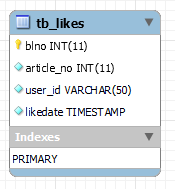

# 좋아요 기능

##### 1. 좋아요 기능을 위한 테이블 생성



###### 1.1  테이블을 생성하고 tb_article에 컬럼 추가

```mysql
CREATE TABLE tb_likes (
  blno     	   INT         NOT NULL AUTO_INCREMENT,
  article_no   INT         NOT NULL,
  user_id      VARCHAR(50) NOT NULL,
  likedate 	   TIMESTAMP   NOT NULL DEFAULT NOW(),
  PRIMARY KEY (blno)
);

ALTER TABLE tb_article ADD COLUMN likes_cnt INT(11);

```

###### 1.2 좋아요를 위한 ArticleLikeVO 생성

```java
public class ArticleLikeVO {

	    // 추천번호
	    private int blno;
	    // 게시글 번호
	    private int article_no;
	    // 추천회원 아이디
	    private String userId;
	    // 추천 일시
	    private Date likedate;
	    private ArticleVO articleVO;
	    private UserVO userVO;
	    
		public ArticleVO getArticleVO() {
			return articleVO;
		}
		public void setArticleVO(ArticleVO articleVO) {
			this.articleVO = articleVO;
		}
		public UserVO getUserVO() {
			return userVO;
		}
		public void setUserVO(UserVO userVO) {
			this.userVO = userVO;
		}
		public int getBlno() {
			return blno;
		}
		public void setBlno(int blno) {
			this.blno = blno;
		}
		public int getArticle_no() {
			return article_no;
		}
		public void setArticle_no(int article_no) {
			this.article_no = article_no;
		}
		public String getUser_id() {
			return userId;
		}
		public void setUser_id(String user_id) {
			this.userId = user_id;
		}
		public Date getLikedate() {
			return likedate;
		}
		public void setLikedate(Date likedate) {
			this.likedate = likedate;
		}
		@Override
		public String toString() {
			return "ArticleLikeVO [blno=" + blno + ", article_no=" + article_no + ", user_id=" + userId + ", likedate="
					+ likedate + ", articleVO=" + articleVO + ", userVO=" + userVO + "]";
        }
	}
```

##### 2. LikeDAO , LikeDAOImpl , likeMapper 생성 및 작성

###### 2.1 LikeDAO 인터페이스 작성

```java
public interface LikeDAO {

    // 게시글 추천 하기
    public void createBoardLike(ArticleLikeVO boardLikeVO) throws Exception;

    // 게시글 추천 취소
    public void deleteBoardLike(ArticleLikeVO boardLikeVO) throws Exception;

    // 게시글 추천 갯수
    public int countBoardLikes(Integer article_no) throws Exception;

    // 게시글 추천 여부
    public boolean checkBoardLike(Integer article_no, String userId) throws Exception;

}
```

###### 2.2 LikeDAOImpl 클래스 작성

```java
@Repository
public class LikeDAOImpl implements LikeDAO {

    @Inject
    private SqlSession sqlSession;

    private static final String NAMESPACE = "mc.sn.KEPL.mappers.like.LikeMapper";

    @Override
    public void createBoardLike(ArticleLikeVO boardLikeVO) throws Exception {
        sqlSession.insert(NAMESPACE + ".createBoardLike", boardLikeVO);
    }

    @Override
    public void deleteBoardLike(ArticleLikeVO boardLikeVO) throws Exception {
        sqlSession.delete(NAMESPACE + ".deleteBoardLike", boardLikeVO);
    }

    @Override
    public int countBoardLikes(Integer article_no) throws Exception {
        return sqlSession.selectOne(NAMESPACE + ".countBoardLikes", article_no);
    }

    @Override
    public boolean checkBoardLike(Integer article_no, String userId) throws Exception {

        Map<String, Object> paramMap = new HashMap<>();
        paramMap.put("article_no", article_no);
        paramMap.put("userId", userId);

        return sqlSession.selectOne(NAMESPACE + ".checkBoardLike", paramMap);
    }

}
```

###### 2.3 likeMapper.xml 작성

```java
<mapper namespace="mc.sn.KEPL.mappers.like.LikeMapper">

  
    <!--게시글 추천 하기-->
    <insert id="createBoardLike">
        INSERT INTO tb_likes (
            article_no
            , user_id
        ) VALUES (
            #{article_no}
            , #{userId}
        )
    </insert>

    <!--게시글 추천 취소-->
    <delete id="deleteBoardLike">
        DELETE FROM tb_likes
        WHERE article_no = #{article_no}
              AND user_id = #{userId}
              
    </delete>

    <!--게시글 추천수--><!-- SELECT COUNT(article_no) -->
    <select id="countBoardLikes" resultType="int">
        SELECT COUNT(blno) 
        FROM tb_likes
        WHERE article_no = #{article_no}
    </select>

    <!--게시글 추천 여부 확인-->
    <select id="checkBoardLike" resultType="boolean">
        SELECT COUNT(blno)
        FROM tb_likes
        WHERE article_no = #{article_no}
              AND user_id = #{userId}
    </select>
    

    
    <resultMap id="ArticleResultMap" type="ArticleVO">
        <id property="article_no" column="article_no"/>
        <result property="title" column="title" />
        <result property="content" column="content" />
        <result property="writer" column="writer" />
        <result property="regDate" column="regdate" />
        <result property="viewCnt" column="viewcnt" />
        <result property="replyCnt" column="reply_cnt" />
        <result property="fileCnt" column="file_cnt" />
        <result property="writerImg" column="writerImg" />
        <result property="likeCnt" column="like_cnt" />
        <association property="userVO" resultMap="userVOResultMap"/>
    </resultMap>
    
    <resultMap id="userVOResultMap" type="UserVO">
        <id property="userId" column="user_id"/>
        <result property="userPw" column="user_pw"/>
        <result property="userName" column="user_name"/>
        <result property="userEmail" column="user_email"/>
        <result property="userJoinDate" column="user_join_date"/>
        <result property="userLoginDate" column="user_login_date"/>
        <result property="userSignature" column="user_signature"/>
        <result property="userImg" column="user_img"/>
        <result property="userPoint" column="user_point"/>
        
    </resultMap>
    
</mapper>
```

##### 3. LikeService , LikeServiceImpl 생성 및 작성

###### 3.1 LikeService 인터페이스 작성

```java
public interface LikeService {
    // 게시글 추천 하기
    public void createBoardLike(ArticleLikeVO boardLikeVO) throws Exception;

    // 게시글 추천 취소
    public void removeBoardLike(ArticleLikeVO boardLikeVO) throws Exception;

    // 게시글 추천 갯수
    public int countBoardLikes(Integer article_no) throws Exception;

    // 게시글 추천 여부
    public boolean checkBoardLike(Integer article_no, String userId) throws Exception;
}
```

###### 3.2 LikeServiceImpl 클래스 작성

```java
@Service
public class LikeServiceImpl implements LikeService {
    
    private LikeDAO likeDAO;
    private ArticleDAO articleDAO;
    
    @Inject
    public LikeServiceImpl(LikeDAO likeDAO, ArticleDAO articleDAO) {
        this.likeDAO = likeDAO;
        this.articleDAO = articleDAO;
    }	
    
    @Transactional
    @Override
    public void createBoardLike(ArticleLikeVO boardLikeVO) throws Exception {
        likeDAO.createBoardLike(boardLikeVO);
        articleDAO.updateLikescnt(boardLikeVO.getArticle_no(),1);
    }

    @Transactional
    @Override
    public void removeBoardLike(ArticleLikeVO boardLikeVO) throws Exception {
        likeDAO.deleteBoardLike(boardLikeVO);
        articleDAO.updateLikescnt(boardLikeVO.getArticle_no(),-1);
    }

    @Override
    public int countBoardLikes(Integer article_no) throws Exception {
        return likeDAO.countBoardLikes(article_no);
    }

    @Override
    public boolean checkBoardLike(Integer article_no, String userId) throws Exception {          	
    	return likeDAO.checkBoardLike(article_no, userId);
    
    }


}
```

##### 4. LikeController 생성 및 작성

```java
@RestController
@RequestMapping("/like")
public class LikeController {

	private final LikeService likeService;
	
    @Inject
    public LikeController(LikeService likeService) {
    	this.likeService=likeService;
    }
   
    
    // 게시글 추천 하기
    @RequestMapping(value = "/create/{article_no}/{userId}", method = RequestMethod.POST)
    public ResponseEntity<String> createBoardLike(@PathVariable("article_no") Integer article_no,
                                                  @PathVariable("userId") String userId) {
        ResponseEntity<String> entity = null;
        try {
        	ArticleLikeVO boardLikeVO = new ArticleLikeVO();
            boardLikeVO.setArticle_no(article_no);
            boardLikeVO.setUser_id(userId);
            likeService.createBoardLike(boardLikeVO);
            entity = new ResponseEntity<>("BOARD LIKE CREATED", HttpStatus.OK);
        } catch (Exception e) {
            entity = new ResponseEntity<>(e.getMessage(), HttpStatus.BAD_REQUEST);
        }
        return entity;
    }

    // 게시글 추천 취소
    @RequestMapping(value = "/remove/{article_no}/{userId}", method = RequestMethod.DELETE)
    public ResponseEntity<String> removeBoardLike(@PathVariable("article_no") Integer article_no,
                                                  @PathVariable("userId") String userId) {
        ResponseEntity<String> entity = null;
        try {
        	ArticleLikeVO boardLikeVO = new ArticleLikeVO();
            boardLikeVO.setArticle_no(article_no);
            boardLikeVO.setUser_id(userId);
            likeService.removeBoardLike(boardLikeVO);
            entity = new ResponseEntity<>("BOARD LIKE REMOVED", HttpStatus.OK);
        } catch (Exception e) {
            entity = new ResponseEntity<>(e.getMessage(), HttpStatus.BAD_REQUEST);
        }
        return entity;
    }

    // 게시글 추천 갯수
    @RequestMapping(value = "/count/{article_no}", method = RequestMethod.GET)
    public ResponseEntity<Map<String, Object>> countBoardLikes(@PathVariable("article_no") Integer article_no) {
        ResponseEntity<Map<String, Object>> entity = null;
        try {
            int likeTotalCount = likeService.countBoardLikes(article_no);
            Map<String, Object> map = new HashMap<>();
            map.put("likeTotalCount", likeTotalCount);
            entity = new ResponseEntity<>(map, HttpStatus.OK);
        } catch (Exception e) {
            e.printStackTrace();
            entity = new ResponseEntity<>(HttpStatus.BAD_REQUEST);
        }
        return entity;
    }

    // 게시글 추천 여부
    @RequestMapping(value = "/check/{article_no}/{userId}", method = RequestMethod.GET)
    public ResponseEntity<Map<String, Object>> checkBoardLike(@PathVariable("article_no") Integer article_no,
                                                              @PathVariable("userId") String userId) {
        ResponseEntity<Map<String, Object>> entity = null;
        try {
            boolean checkBoardLike = likeService.checkBoardLike(article_no, userId);
            Map<String, Object> map = new HashMap<>();
            map.put("checkBoardLike", checkBoardLike);
            entity = new ResponseEntity<>(map, HttpStatus.OK);
        } catch (Exception e) {
            e.printStackTrace();
            entity = new ResponseEntity<>(HttpStatus.BAD_REQUEST);
        }
        
        return entity;
    }

}
```

##### 5. 좋아요 갯수 표시를 위한 articleMapper 수정

```java
<update id="updateLikescnt">
	    UPDATE tb_article
	    SET likes_cnt = likes_cnt + #{amount}
	    WHERE article_no = #{article_no}
</update>
```

###### 5.1 좋아요 갯수 표시를  위하여 likes_cnt 추가

```java
<select id="listSearchMoviebyviewcnt" resultMap="ArticleResultMap">
    <![CDATA[
    SELECT
            ta.article_no,
            title,
            content,
            writer,
            regdate,
            viewcnt, 
            file_cnt,
            reply_cnt,
            hashtag,
            fullname,
            likes_cnt
        from tb_article as ta
			left join tb_article_file as taf on ta.article_no = taf.article_no
        WHERE ta.article_no > 0 and category='movie' 
    ]]>
		<include refid="search" />
    <![CDATA[
    group by title
    ORDER BY viewcnt DESC
    LIMIT #{pageStart}, #{perPageNum}
    ]]>
	</select>
```

###### 5.2 resultMap property 추가

```java
<result property="likesCnt" column="likes_cnt" /> 
```

#####  6. 좋아요 갯수 표시를  위하여 ArticleDAO , ArticleDAOImpl 수정

###### 6.1 ArticleDAOImpl

```
@Override
    public void updateLikescnt(int article_no, int amount) throws Exception {
		
		 Map<String, Object> map = new HashMap<String, Object>();
		 map.put("article_no", article_no);
		 map.put("amount", amount);
		 
		 sqlSession.update(NAMESPACE + ".updateLikescnt",map); 
    }
```

###### 6.2 ArticleDAO

```java
    void updateLikescnt(int article_no, int amount) throws Exception;

```


##### 7. 좋아요 갯수 표시를 위한 list , read 수정

###### 7.1 list

```html
<i class="badge badge-danger"><i class="boardLike"><i class="fa">♥+${article.likesCnt}</i></i></i>
```

###### 7.2 read

```html
<style>
	#like{
		text-align:center;
	}
	.like {display:inline-block;zoom:1;.display:inline;}
</style>


<div id="like">
	<div></div>
		<div class="like" >
			<button type="button" class="btn btn-danger btn-lg "  id="likeBtn">
				<i class="fa fa-thumbs-o-up fa-heart boardLike">  <span></span></i>   
			</button>
			<br></br>
		</div>
	<div></div>
 </div>
```

```java
var article_no = "${article.article_no}";
var boardLike = $(".boardLike");
//게시글 추천수
var totalCountBoardLike = function () {
   $.getJSON("/like/count/" + article_no, function (result) {
      console.log(result.likeTotalCount);
      boardLike.find("span").html(result.likeTotalCount);
   });
};
totalCountBoardLike();
//게시글 추천여부 확인

var checkBoardLike = function () {
   boardLike.find("i").attr("class", "fa fa-thumbs-o-up fa-heart");
   $.getJSON("/like/check/" + article_no + "/" + userId, function (result) {
   	console.log(result.checkBoardLike);
       var likeCheck = result.checkBoardLike;
       
       if (likeCheck == false) {
           boardLike.find("i").attr("class", "fa fa-thumbs-o-up fa-heart");
           if (confirm("추천하시겠습니까?")) {
               $.ajax({
                   type: "post",
                   url: "/like/create/" + article_no + "/" + userId,
                   headers: {
                       "Content-Type" : "application/json",
                       "X-HTTP-Method-Override" : "POST"
                   },
                   dataType: "text",
                   success: function (result) {
                       console.log("result : " + result);
                       if (result == "BOARD LIKE CREATED") {
                           alert("게시글이 추천되었습니다.");                            
                           totalCountBoardLike();
                       }
                   }
               });
           
           }
           return;
       }
       
       else if (likeCheck == true){
       if(confirm("추천을 취소하시겠습니까?")) {
           $.ajax({
               type: "delete",
               url: "/like/remove/" + article_no + "/" + userId,
               headers: {
                   "Content-Type" : "application/json",
                   "X-HTTP-Method-Override" : "DELETE"
               },
               dataType: "text",
               success: function (result) {
                   console.log("result : " + result);
                   if (result == "BOARD LIKE REMOVED") {
                       alert("게시글 추천이 취소되었습니다.");                        
                       totalCountBoardLike();
                   }
           	   }
          	 });
			
       }
       
       }
       
   });
};

```

